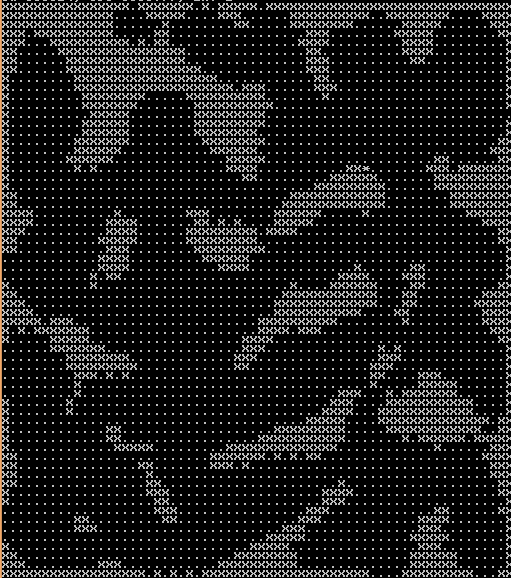
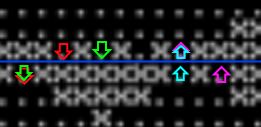

(ENGLISH VERSION WILL BE HERE IN FUTURE)
========================================

# MineBotGame

## Overview

В игре предлагается разработать стратегию, которая будет управлять действиями игрока.

Стратегия оформляется в виде программы на языке lua (maybe moar)

---------------------------------------------------------

__Комнаты - под вопросом....__

Действие игры происходит глубоко под землёй, в пещерах, где можно найти полезные ископаемые.

Игровая карта является набором комнат, являющимися равными прямоугольниками. Они расположены вплотную друг к другу, поэтому комнату можно индексировать с помощью двух координат (X – столбец и Y – строка). Пример комнаты – на рисунке.

Перемещение между комнатами осущестляется при выходе за пределы комнаты с краю. При этом игрок оказывается в комнате, смежной с текущей, в точке наиболее близкой к той, из которой юнит переместился. Если таких точек несколько – он перемещается в точку, с меньшей координатой X.

Пояснение к переходу между комнатами можно видеть на изображении. Синим отмечена граница двух комнат. Стрелками соответственных цветов – перемещения игрока.

## Gameplay

Геймплей заключается в управлении роботизированными юнитами (Unit) и зданиями (Building) игрока. Обобщённо они называются игровыми объектами (GameObject).

Здания являются предопределёнными и выполняют заранее продуманный, ограниченный набор функций. Набор функций юнитов зависит от того, какие модули (Module) и улучшения (Upgrade) он имеет.

И здания, и юниты имеют шкалу сохранности (Heal Points, Durability Points or smth like this). При достижении отметки нуля – здание или юнит уничтожается.

### Buildings

Здания могут выполнять

- Изучение доступных в них исследований (например, для разблокировки
    постройки новых зданий, создания модулей, улучшений, юнитов)

- Создание доступных в них юнитов

- Специфические для отдельных зданий функции (создание и установка
    модулей, улучшений)
- Саморазрушение без возврата ресурсов  

Здание                           | Размер | Описание | Функции
---------------------------------|--------|----------|--------
База (Base)                      | 4x4    | Ваше основное здание. Если оно будет уничтожено – вы проиграете. Работает как склад, увеличивает максимальное количество юнитов. Разрешено строить не более 4х штук. | Создание юнитов
Склад (Storage)                  | 3x4    | Увеличивает лимит на ресурсы. Не более N штук. | Исследование: Межпространственный склад (увеличение вместимости)
Фабрика Модулей (Module Factory) | 4x4    | Позволяет производить модули для роботов и устанавливать их (сразу). Не более N штук. | Производит модули, см. таблицу ниже
Генератор (Generator)            | 2x2    | Пассивно генерирует ресурс - энергию | Усследование - квантовый двигатель (WUT)
Пушка (Gun)                      | 2x2    | Бабахает по врагам | Бабахнуть по врагу
Лаборатория (Laboratory)         | 2x2    | То же, что и Module Factory, но модули сложнее, прокаченнее, хорошие, годные | Проводит исследования, см. таблицу ниже

### Units

Юниты могут выполнять:
- Перемещение на 1 клетку на север, запад, юг или восток (Длительность зависит от параметров)
- Простой (Idle) (1 тик)
- Функции, которые предоставляют различные модули

Модуль               | Вес | Энергия       | Требования      | Функции
---------------------|-----|---------------|-----------------|--------
Добыча               | 25  | 10            | -               | Добыча руд. Скорость зависит от улучшений
Ближний бой (ББ)     | 15  | 10            | -               | Наносит урон 1 вражескому юниту в радиусе соседних 8ми клеток. Скорость варьируется
Дальний бой (ДБ)     | 25  | 20            | Пушки от бога   | Наносит урон на расстоянии. Радиус действия, скорость варьируются
Строительство        | 30  | 10            | -               | Позволяет строить здания
Починка              | 50  | 20            | Боевая механика | Позволяет чинить здания и юниты, восстанавливая очки целостности

TODO: Вес - баланс.. Он замедляет. Благодаря этому сильно жирные юниты будут слоупочными. Энергозатраты тоже. Всё написано НАОБУМ. Требует подстройки

Улучшение            | Вес | Энергия*              | Требования    | Описание
---------------------|-----|-----------------------|---------------|---------
Энергоэффективность  | 2   | ?                     | -             | Увеличивает эффективность работы энергоустановок
Ускорение бура       | 3   | ?                     | Добыча        | Увеличивает скорость копания
Ускорение ББ         | 3   | ?                     | ББ            | Увеличивает суорость ближнего боя
Ускорение ДБ         | 4   | ?                     | ДБ            | Увеличивает скорость дальнего боя
Шило в попе          | 4   | ?                     | -             | Увеличивает скорость движения
Прораб               | 3   | ?                     | Строительство | Увеличивает скорость строительства
(?) Радиус видимости | 15  | ?                     | ?             | Увеличивает радиус видимости

Количество юнитов ограничивается количеством (не более __N__ на игрока) и количеством энергии.

### Energy

Энергия не копится. Если она не была использована - она исчезает. Поэтому здесь и далее энергия - это поток энергии. Т.е. если генератор производит 10 единиц энергии, то юнит эти 10 единиц использует константно. Имеется 0 свободных единиц энергии
Для производства юнита или установки модуля/улучшения энергии должно быть достаточно для его снабжения энергией. Если энергии недостаточно - юнит не производится итп. 
Если сначалы был произведён юнит, но генераторы, снабжавшие его уничтожены - он не умирает, а становится тем слабее, чем больше энергии ему не хватает. Сначала энергия равномерно режется юнитам, потом зданиям.

## Realization

Модули и апгрейды изменяют статы бота с помощью декоратора